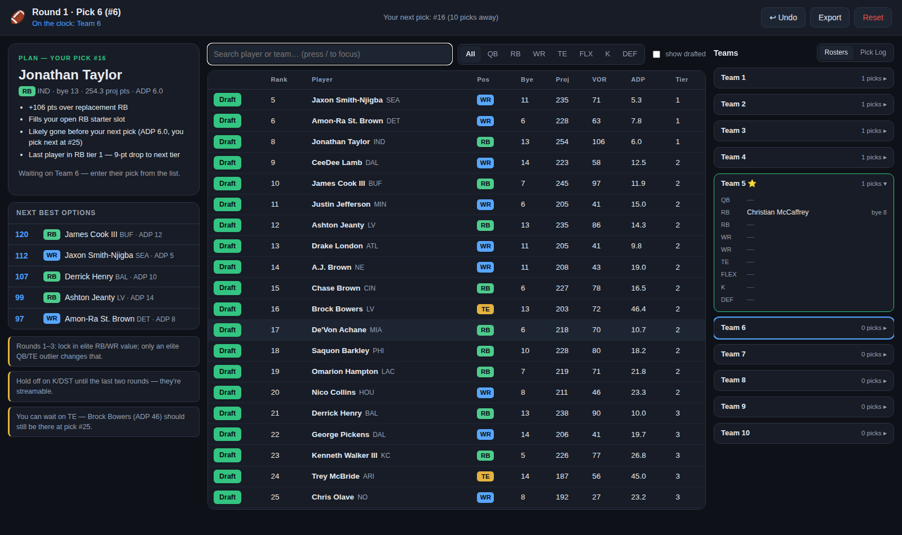
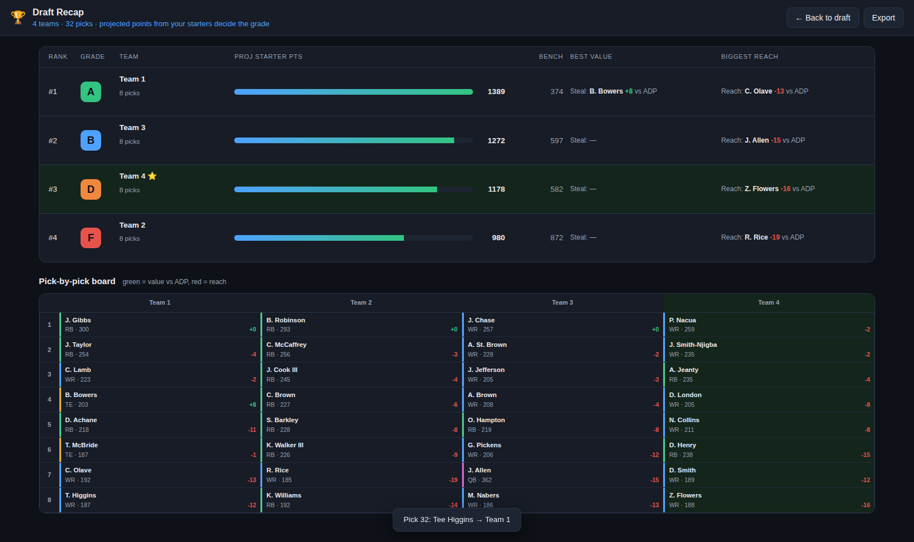

# 🏈 Draft Command — fantasy football live-draft assistant

A local web app that tells you **exactly who to pick next** during your fantasy
football draft. You enter every pick as it happens (yours and everyone
else's), and it keeps recomputing the best available pick for your roster,
your league size, and your draft slot.



## Quick start

```bash
uv run draft-optimizer serve          # starts http://127.0.0.1:8787 and opens a browser
```

Before draft day, refresh the player data (takes ~30 seconds):

```bash
uv run draft-optimizer update-data    # refreshes all three scoring formats
```

No API keys, no accounts — everything runs locally and the data sources are
free public endpoints.

## Using it during a draft

1. **Setup** — pick your scoring format (half-PPR is the Yahoo default), the
   number of teams, your draft slot, and (optionally) roster slots and team
   names. Defaults match a standard Yahoo 10-team league.
2. **Draft** — the big green card always shows the player to take:
   - On your turn it says **PICK NOW** with the reasons (value over
     replacement, tier cliff, "he won't last until your next pick", roster
     need, bye conflicts).
   - Between your turns it switches to **PLAN** mode, showing who to target at
     your next pick given the current board.
3. **Enter picks fast** — press `/` to jump to search, type a few letters,
   press **Enter** to draft the top match to whichever team is on the clock.
   Or click **Draft** on any row. **Undo** (or Ctrl/Cmd-Z) reverses mistakes.
4. Everything autosaves to your browser — refresh or close the tab and hit
   **Resume Saved Draft** to continue. **Export** downloads the full pick log
   as JSON.

### Keepers

If your league lets teams keep players from last season (each keeper costing
that team's pick from the round he was drafted in), open **Keepers** on the
setup screen:

- Add each keeper as *team + player + round it costs* — yours and any rivals'
  keepers you know about (up to 2 per team).
- For **your** candidates you get an instant verdict: **KEEP** (beats the best
  player you'd likely draft fresh at that slot, with the surplus in projected
  points), **PASS**, or **TOSS-UP** — plus an overall "keep 0/1/2" call, so
  you can decide before locking anything in.
- During the draft, kept players are off the board from pick one (tagged
  KEPT), and when the draft reaches a keeper's round, that pick auto-fills
  and the assistant plans around it — e.g. if your round-3 pick is spent on a
  keeper, "your next pick" and all wait-on-him math skip straight to round 4.

### Draft recap & grades

When the last pick is in, a recap opens automatically (or hit **🏆 Recap** in
the top bar any time):

- Every team ranked and graded **A–F** on projected starting-lineup points
  relative to the league (bench counts a quarter-weight), with each team's
  best steal and biggest reach vs ADP.
- A color-coded **pick-by-pick board** — every pick with projected points and
  its value vs market (green = got him late, red = reached).



## Getting data into Yahoo

The blunt truth: **Yahoo has no file import anywhere** — no CSV upload for
draft results, no API write for drafts (the Fantasy Sports API's
`draft_results` endpoint is read-only), and no import for pre-draft
rankings. Three flows exist, and the app supports all of them:

1. **Live Yahoo draft (most common)** — nothing to import. Run this app in a
   second window next to the Yahoo draft room, mirror every pick as it
   happens, and make the pick Yahoo-side that the app tells you.
2. **Offline draft** — if your league drafts in person, the commissioner
   enters results afterward via *Commissioner → Draft & Keepers → Submit
   Draft Results*, which fills **each team's roster in turn** (not
   pick-by-pick). The recap's **Yahoo entry sheet** export produces a CSV in
   exactly that team-by-team order, so entry is just reading down the sheet.
3. **Pre-draft rankings** — Yahoo only supports drag-and-drop reordering
   natively, but the free ["Custom Player Rankings Import Tool"](https://chromewebstore.google.com/detail/custom-player-rankings-im/ploohkkaccmkhohmkeoamlbmmenhkdge)
   Chrome extension imports a CSV whose first column is player names. The
   setup screen's **Rankings CSV** button exports the board in that format
   (set Yahoo's pre-rank page to "Top 300" before running the import).

## How the recommendations work

The engine encodes the consensus of the draft-strategy research baked into
this repo (see `src/draft_optimizer/web/engine.js`):

- **Value Over Replacement (VOR)** — a player's worth is his projected points
  minus the projected points of the replacement-level player at his position
  for your league size (e.g. ~RB29 in a 10-team league). This is why the app
  won't take a QB in round 2 even though QBs score the most raw points.
- **The wait rule** — using live ADP, it estimates whether a player will
  survive until your next snake pick. Players about to vanish get urgent;
  players you can get a round later get discounted ("You can wait on TE —
  Brock Bowers should still be there at pick #25").
- **Tier cliffs** — takes from the tier that's about to run out when there's a
  real point drop to the next tier.
- **Roster gates** — fills starters before bench, opens the QB window around
  round 6 (earlier only for a fallen elite), holds K/DEF until the final
  rounds, keeps the bench balanced (~3 RB / 2-3 WR) with upside picks late.
- **Bye weeks** — a tiebreaker-sized penalty when a pick stacks the same bye
  at one position (starters' bye clashes are also flagged ⚠ in your roster
  panel). Never a reason to skip a clearly better player.

## Data sources (fetched by `update-data`)

| What | Source |
|---|---|
| Rankings, tiers, byes | FantasyPros expert consensus (aggregates 100+ experts, including Yahoo's rankers) |
| Season projections, injury flags | Sleeper |
| ADP per league size | [FantasyFootballCalculator](https://fantasyfootballcalculator.com/adp) live mock drafts |

Data files are baked into `src/draft_optimizer/web/data/` so the app works
offline; re-run `update-data` any time to refresh.

## Development

```bash
PYTHONPATH=src python3 -m draft_optimizer.cli serve --no-browser  # run without installing
node tests/test_engine.js                                         # engine tests + full draft simulation
```

The stack is deliberately boring: a stdlib-only Python data fetcher and web
server, plus a dependency-free vanilla-JS single-page app.
